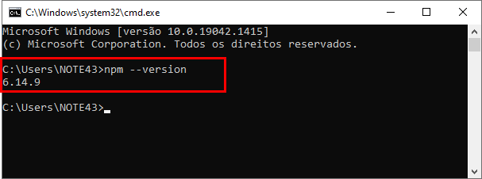

O Retype é uma plataforma que permite criar e gerenciar documentações.
É uma ferramenta gratuita e pode ser usada juntamente com o Github para hospedagem e gerenciamento do conteúdo criado.
Os arquivos possuem estrutura _'.md'_ o que facilita muito a criação/edição de documentos.

Aqui iremos aprender como instalar, manipular e hospedar uma página no Github.

Vem comigo!!!

---

# Site Oficial
O site oficial oferece total suporte ao usuário. 
Se você possui conhecimento em inglês, conseguirá seguir os passos para criação da sua própria página.
Por ser uma ferramenta gratuita, também é possível usá-la para documentar arquivos da sua empresa/organização.

>👉 [Retype Oficial](https://retype.com/)

---

# Pré Requisitos
Para instalar o Retype, você precisará ter instalado em sua máquina uma das opções a seguir:
`npm`, `yarn` o `dotnetCLI`.

Para nosso artigo, usaremos a instalação pelo `npm`.

>🤩 **Se liga na Dica:**   
Para esse tutorial estou com o npm na versão abaixo:  
_Comando:_ `npm --version`

 

